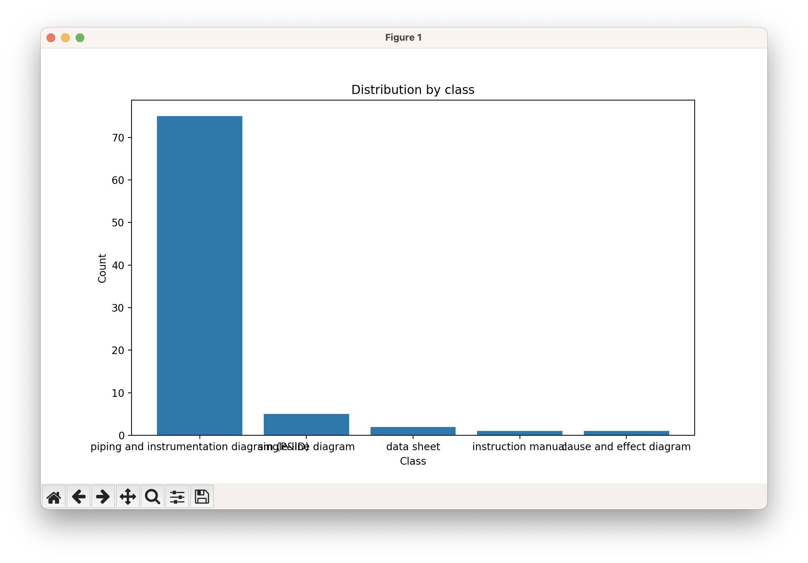
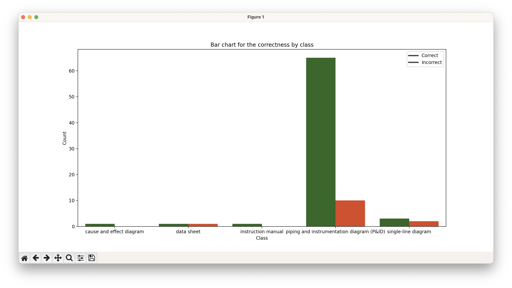

## Setup & installation
0. Run ```pip install -r ./requirements.txt```

To reproduce the results first gather the datasets:

1. In the /datasets folder download these 2 datasets (instructions in the link)
```https://universe.roboflow.com/zuyd/p-id-n7hsv```
```https://universe.roboflow.com/bsee/s1_d```

1. Install dependencies and authenticate with the Google API 
   ```https://cloud.google.com/vertex-ai/docs/generative-ai/multimodal/sdk-for-gemini/gemini-sdk-overview-reference```

3. Execute with ```python execute.py```

Note: the categories are

1. P&IDs
2. Single line diagrams
3. Data sheet
4. Instruction manual
5. Cause and Effect


## Dataset:



## Accuracy:

The percentage of correct responses is 84.52%

## By category:

